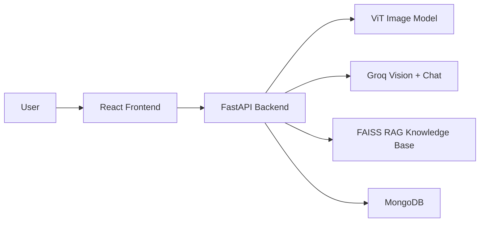

# SkinSage AI

SkinSage AI is a full-stack dermatology assistant that helps users upload a skin image, get a fast model prediction, and receive AI-generated guidance in a chat-style interface. It combines image classification, a vision-based review, retrieval-augmented chat, and session history so the result is easy to inspect and discuss.

## What it does

- Upload a skin image and get an immediate condition prediction.
- Ask follow-up questions in the Analyze tab and receive structured AI advice.
- Store chat history per user so previous cases can be reviewed later.
- Show dashboard analytics such as past analyses and common conditions.

## Why this project matters

- It demonstrates an end-to-end AI product, not just a model.
- It uses a real frontend, backend, authentication, database, and model pipeline.
- It is easy to explain in an interview because the user flow is simple: upload image, get prediction, ask questions, review history.

## Simple Architecture



## Main Features

- Skin image prediction with confidence score and differential conditions.
- AI assistant that explains the result in clinical language.
- Chat history saved per account.
- Dashboard with analysis count and recent activity.
- Login and settings support.
- Graceful fallback when the AI model is unavailable.

## Tech Stack

- Frontend: React, TypeScript, Vite, Tailwind CSS, Framer Motion
- Backend: FastAPI, Python, Uvicorn
- AI/ML: Vision Transformer, Groq LLM, sentence-transformers, FAISS
- Database: MongoDB / Motor
- Auth: JWT, bcrypt

## How the app works

1. The user logs in.
2. The user uploads a skin image and optionally adds symptoms.
3. The backend runs the image model and vision analysis.
4. The chat endpoint turns that result into a readable medical response.
5. The frontend shows the diagnosis, explanation, and history.

## Project Structure

- `frontend/` contains the React app.
- `backend/` contains the FastAPI server, ML logic, chatbot, and auth.
- `backend/best_small_model/` stores the image model files.
- `backend/vectorstore/db_faiss/` stores the retrieval knowledge base.

## Setup

### Backend

```bash
cd backend
python -m venv venv
venv\Scripts\activate
pip install -r requirements.txt
uvicorn api:app --reload --host 0.0.0.0 --port 8000
```

### Frontend

```bash
cd frontend
npm install
npm run dev
```

## Environment Variables

Create a `.env` file in the project root or `backend/`:

```env
GROQ_API_KEY=your_groq_key
MONGODB_URI=mongodb://localhost:27017/
JWT_SECRET=your_secret_key
```

## Important API Endpoints

- `POST /auth/signup` - create account
- `POST /auth/login` - login and get token
- `POST /predict` - image classification
- `POST /analyze-image` - vision-based analysis
- `POST /chat` - AI assistant response
- `GET /chat/sessions` - load history
- `GET /dashboard/summary` - dashboard stats

## Interview Talking Points

- The system uses a two-step approach: fast model prediction first, then LLM reasoning.
- RAG keeps responses more grounded by retrieving medical context before generation.
- Chat history makes the app feel like a real clinical assistant rather than a one-shot demo.
- The app is built to degrade safely if the LLM or vision service is unavailable.

## Notes

- The project is intended for educational and demo use.
- It should not be treated as a final medical diagnosis tool.
- For a presentation, focus on the workflow, architecture, and safety fallback behavior.

## Future Improvements

- Add lesion segmentation.
- Improve support for more skin tones and lighting conditions.
- Add tests and deployment support.
- Add clearer error messages in the UI.

## License

MIT
